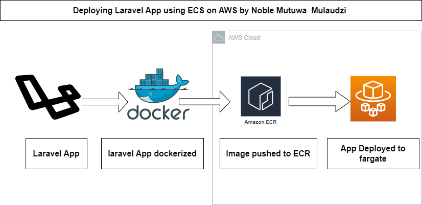

# Deploying a Laravel application on ECS-Fargate 

## to complete this, you should have the following
1.Docker desktop installed on your machine \
2.Docker hub account \
3.AWS account \
4.aws cli installed \
5.Laravel  installed

